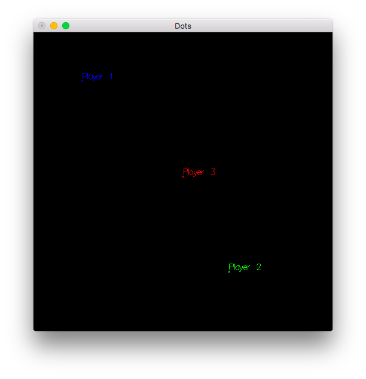

# dots-game

Client-server simple dots game.



### How to build

To clone this repository and build with [Stack](http://docs.haskellstack.org/):

```
git clone https://github.com/fizruk/dots-game.git
cd asteroids
stack setup
stack build
```

### How to run

Server and client executables are called `dots-game-server` and `dots-game-client` respectively.

First you need to start server:

```
stack exec dots-game-server
```

Then to start each client run

```
stack exec dots-game-client
```

### Controls

Player can use arrows (<kbd>←</kbd>, <kbd>↑</kbd>, <kbd>→</kbd>, <kbd>↓</kbd>)
to accelerate his/her dot in the corresponding direction.

To exit the game use <kbd>ESC</kbd>.
